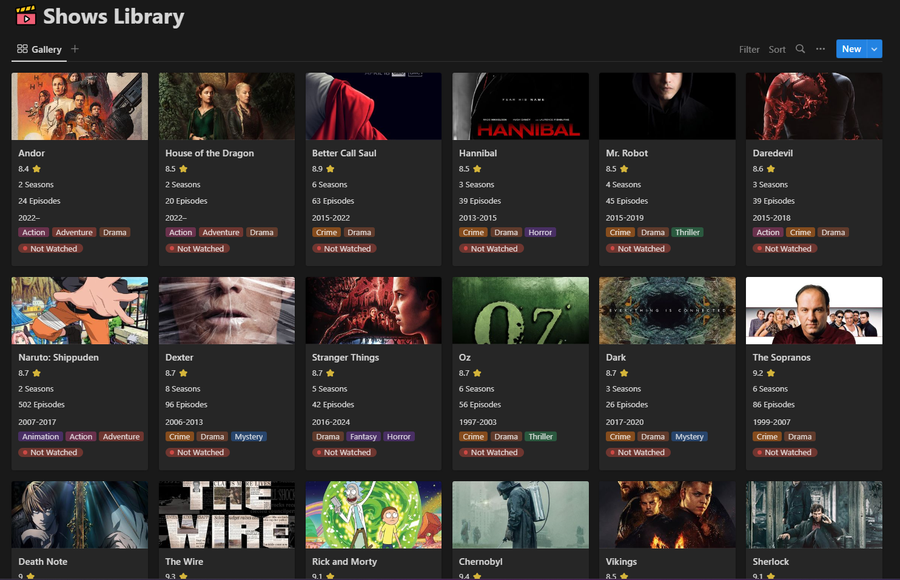

# Notion Movies Library

## Table of Contents
- [Description](#description)
- [Screenshot](#screenshot)
- [Dependencies](#dependencies)
- [Database Properties](#database-properties)
- [Environment Variables](#environment-variables)
- [Usage](#usage)

## Description

Here is a script that calls [Notion API](https://developers.notion.com/) and Add New items to a “Movies Library Database” 

It Pulls Data from Movies Library API which You can get From [Rapid API](https://rapidapi.com/apidojo/api/online-movie-database) 

## Screenshot



## Dependencies

```json
"devDependencies": {
    "@notionhq/client": "^2.2.3",
    "axios": "^1.3.4",
    "dotenv": "^16.0.3"
  },
```

## Database Properties

```
// That will index.js Edit
Rate : Number
Seasons : Number
Release Date : Text
Episodes : Number
Genres : Multi Select

// That won't do anything with file but you will edit
Formulas
Rating // format(prop("Rating")) + " ⭐"
Count of Seasons // format(prop("Seasons")) + if(prop("Episodes") > 1, " Episodes", " Season")
Count of Episodes // format(prop("Episodes")) + if(prop("Episodes") > 1, " Episodes", " Episode")

// Status for you if you watched or not
Status : Watched | Not Watched
```

## Environment Variables

```
NOTION_API_KEY= Notion API From Integration
DATABASE_ID= Database Id From Database Page
RAPID_API_KEY= Rapid API Key // https://rapidapi.com/apidojo/api/online-movie-database
RATE= Rate Property id 
SEASONS= Seasons Property id
RELEASE= Release Date Property id
EPISODES= Episodes Property id
GENRES= Genres Property id
```

## Usage

Organize your Environment Variables and the IMDB Title you can get it like this from URL [tt0944947](https://www.imdb.com/title/tt0944947/)

Add the title to Title Variable and hit the Code below on Command Line and Watch magic

```
node index.js
```